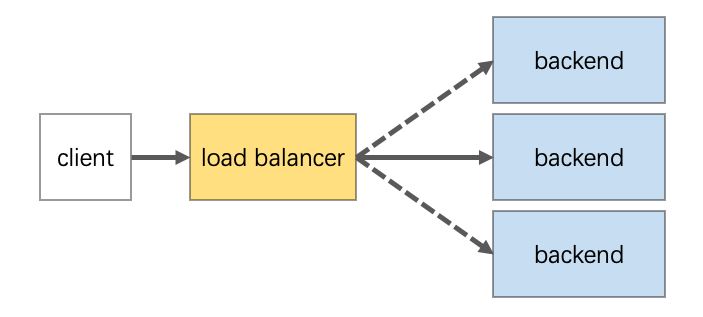
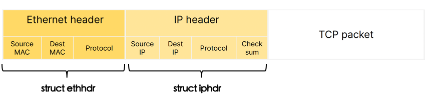
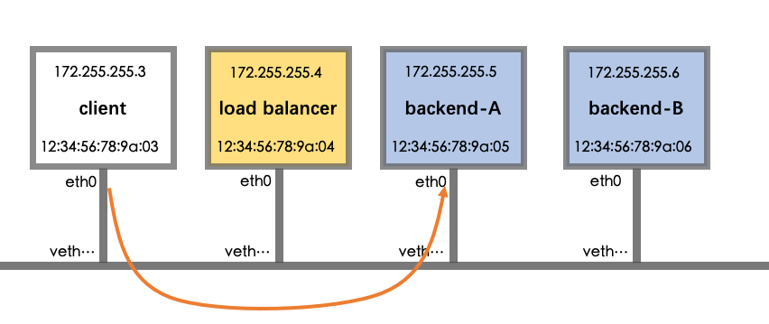
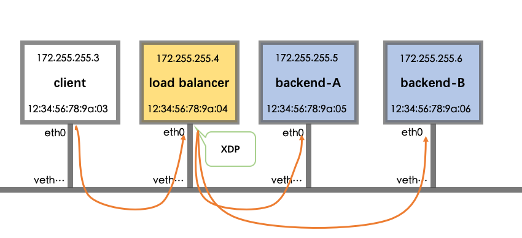
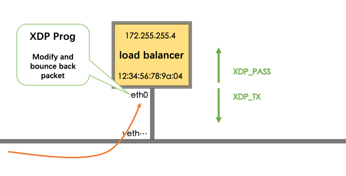

- [DIY A Load Balancer From Scratch](#diy-a-load-balancer-from-scratch)
- [1 Prerequisite](#1-prerequisite)
  - [1.1 What is a loadbalancer](#11-what-is-a-loadbalancer)
  - [1.2 Packet structure](#12-packet-structure)
- [2 Demonstration Environment](#2-demonstration-environment)
- [3 Tech Detail](#3-tech-detail)
  - [3.1 Overview](#31-overview)
  - [3.2 XDP actions](#32-xdp-actions)
  - [3.3 Core logic](#33-core-logic)
- [4 Further](#4-further)
- [5 Reference](#5-reference)

# DIY A Load Balancer From Scratch

Implement an ebpf load balancer in ~100 lines of c code.

Very far from production ready but hopefully it will be sufficient to give you an idea how we can use ebpf to manipulate network packets.

# 1 Prerequisite

## 1.1 What is a loadbalancer

>  **Load balancing** refers to efficiently distributing incoming network traffic across a group of backend servers, also known as a *server farm* or *server pool*.



## 1.2 Packet structure



In the OSI reference model, the network is split into several different layers. In our situation, we are only interested in  Ethernet frame.

- L2: Ethernet header

- L3: IP header

- L4: TCP header

# 2 Demonstration Environment

Our demonstration environment consists 4 components which are shown as below.



All the components are running as docker containers in the same host. Each container has a virtual ethernet interface attached to an unique docker bridge.

Both backend-A and backend-B are [nginx hello demos](https://github.com/nginxinc/NGINX-Demos/tree/master/nginx-hello). There is

To make it simple, both the mac address and the ip address  are managed mannually and only vary in their last byte.

Also, the last byte of mac address for that ethernet  interface is the same as the last byte of ip address.

To quickly setup a new environment, just

```bash
make setup-env
```

# 3 Tech Detail

## 3.1 Overview



The XDP bpf program is attached to the virtual interface in LB container. Every packet ingressed to LB container will be processed by our program.

Our implementation is [NAT mode](https://www.loadbalancer.org/glossary/layer-4-nat-mode/), which means packet arrived in LB container would be DNATed and SNATed.

```
☁  ~  docker exec -it lb bash
root@lb:/diy-l4lb-code# hostname
lb
root@lb:/diy-l4lb-code# ip a
1: lo: <LOOPBACK,UP,LOWER_UP> mtu 65536 qdisc noqueue state UNKNOWN group default qlen 1000
    link/loopback 00:00:00:00:00:00 brd 00:00:00:00:00:00
    inet 127.0.0.1/8 scope host lo
       valid_lft forever preferred_lft forever
60: eth0@if61: <BROADCAST,MULTICAST,UP,LOWER_UP> mtu 1500 xdpgeneric/id:285 qdisc noqueue state UP group default
    link/ether 12:34:56:78:9a:04 brd ff:ff:ff:ff:ff:ff link-netnsid 0
    inet 172.255.255.4/24 brd 172.255.255.255 scope global eth0
       valid_lft forever preferred_lft forever
root@lb:/diy-l4lb-code# make xdp
clang -S \
    -target bpf \
    -Ilibbpf/src\
    -Wall \
    -Wno-unused-value \
    -Wno-pointer-sign \
    -Wno-compare-distinct-pointer-types \
    -Werror \
    -O2 -emit-llvm -c -o lb_kern.ll lb_kern.c
llc -march=bpf -filetype=obj -o lb_kern.o lb_kern.ll
ip link set eth0 xdpgeneric off
ip link set eth0 xdpgeneric obj lb_kern.o sec xdp
root@lb:/diy-l4lb-code#
```

## 3.2 XDP actions



| actions  | description                                                                                             |
| -------- | ------------------------------------------------------------------------------------------------------- |
| XDP_PASS | XDP_PASS means the XDP program chose to pass the packet to the normal network stack for processing.     |
| XDP_DROP | XDP_DROP is perhaps the simplest and fastest action. It simply instructs the driver to drop the packet. |
| XDP_TX   | The XDP_TX action result in TX bouncing the received packet-page back out the same NIC it arrived on.   |

## 3.3 Core logic

```cpp
// We are implementing LB in NAT mode. In the future we can try DSR.
// 1. DNAT: replace destination address with CLIENT or BACKEND, by judging direction.
if (iph->saddr == IP_ADDRESS(CLIENT))
{
  unsigned char backend = BACKEND_A;
  if (bpf_ntohs(tcph->source) % 2)
    backend = BACKEND_B;
  iph->daddr = IP_ADDRESS(backend);
  eth->h_dest[ETH_ALEN - 1] = backend;
}
else /* if the saddr is BACKEND */
{
  iph->daddr = IP_ADDRESS(CLIENT);
  eth->h_dest[ETH_ALEN - 1] = CLIENT;
}
// 2. SNAT: replace source address with LB's vip.
iph->saddr = IP_ADDRESS(LB);
eth->h_source[ETH_ALEN - 1] = LB;

iph->check = iph_csum(iph);

return XDP_TX;
```

# 4 Further

- [DSR Mode Implementation](https://www.loadbalancer.org/blog/direct-server-return-is-simply-awesome-and-heres-why/)

- Flexible address info storage

# 5 Reference

https://github.com/lizrice/lb-from-scratch

https://tech.vijayp.ca/linux-kernel-bug-delivers-corrupt-tcp-ip-data-to-mesos-kubernetes-docker-containers-4986f88f7a19